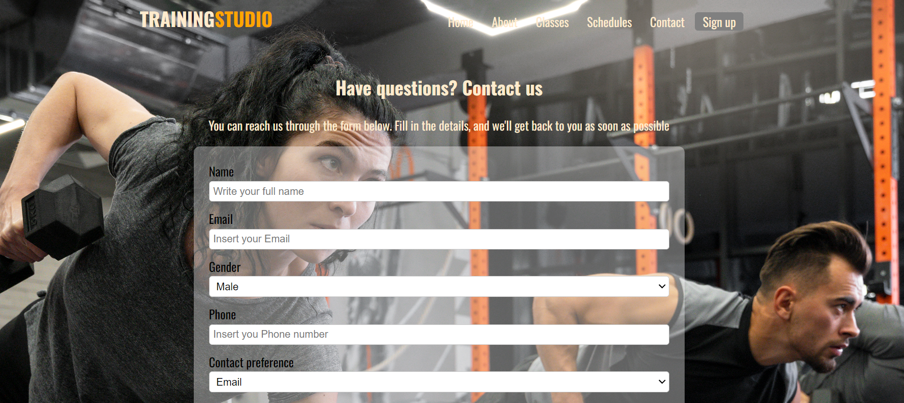
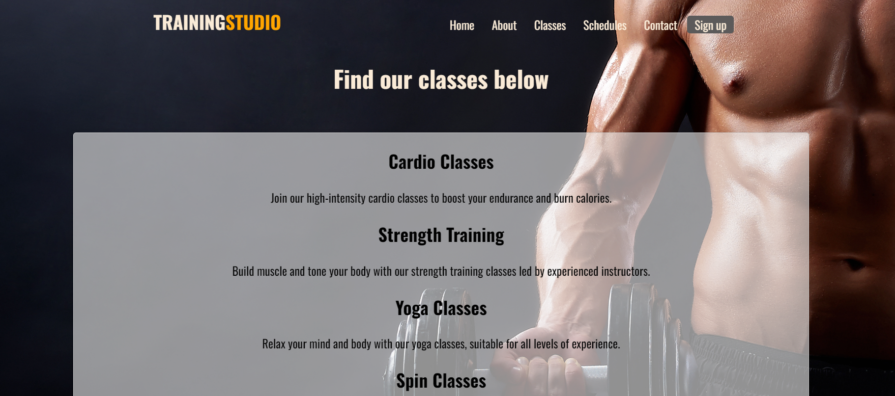
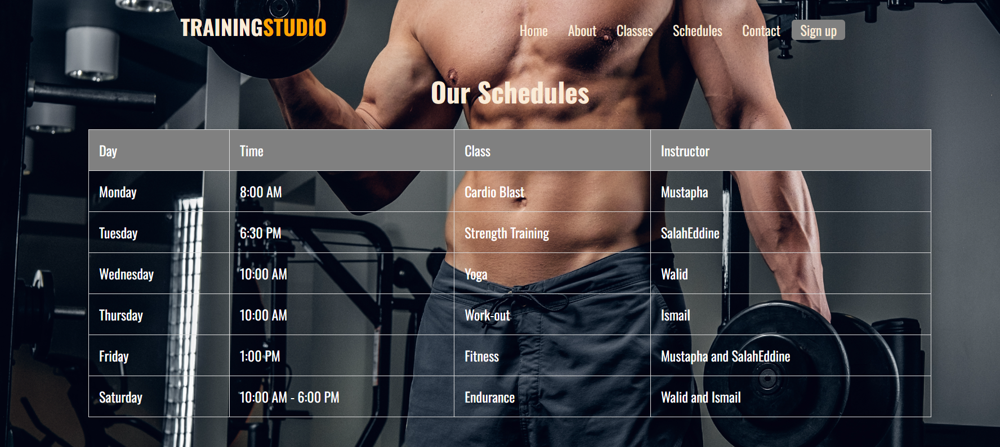
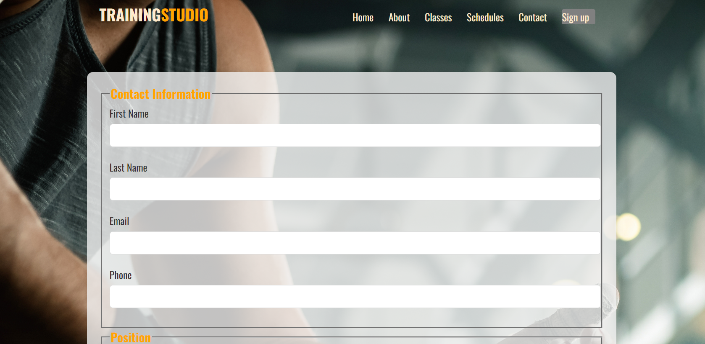

  <!-- cette page a été crée par Mustapha Toubal Seghir  -->
# Projet_web_UA3
# Training Studio Gym

Bienvenue sur le site web du Training Studio Gym.
ce site a été réalisé par les Etudiants de Mr Diarra,inscrits dans le programme de Programmation informatique au collége la cité,Ottawa .

 Projet realisé par :
1/ Chef de projet : Mustapha toubal seghir
2/ collaborateurs : Salaheddine Ziani / Walid Naim / Ismail hussain ali

## Contenue du site

Ce site represente un site de notre salle de gym qui porte le nom de TRAINING STUDIO, il contient toutes les information necessaire pour un client afin de lui permetre de s'inscrire a la salle, de voir les differents programmes qu'on propose, les horraires , les coachs, ainsi que les formulaire necessaires pour prendre contact avec notre gym.

## Structure du Projet " Partie HTML"

Ce projet est structuré de manière à rendre la navigation et le développement plus organisés. Voici une brève description des principaux fichiers et dossiers

- `index.html` : Page d'accueil du site.
- `contact.html`: Page Contact avec un formulaire.
- `Schedules.html`: Page des Horraires et classes de gym.
- `Signup.html`: page d'inscription sur notre site.
- `membership.html`: page complementaire de la page sign-up.
- `Classes.html` : les differents programmes offert par notre salle de gym.
- `About us.html`: Connaitre l'histoire de notre salle de gym et sa creation.
- `Animation.html`: Creation d'une petie animation avec CSS.

##                   "Partie CSS"
- `style.css` : Feuille de style CSS principale de la page home.
- `contact.css`: feuille de style css pour la page contact.
- `Schedules.css`: feuille de style css pour la page schedules.
- `Sign-up.css`: feuille de style css pour la page sign-up.
- `membership.css`: feuille de style css pour la page membership.
- `Classes.css` : feuille de style css pour la page classes.
- `About us.css`: feuille de style css pour la page about us.
- `career.css`: feuille de style css pour la page career.
- `Animation.css`:feuille de style css pour la page Animation .

- `images/` : Dossier contenant les images du site.
- `style/` : Dossier contenant toutes les images du background ainsi que les css des differentes pages.

##                   "Partie JS"
- `index.js` : Code JS pour la Page d'accueil du site.
- `contact.js`: Code Js pour la Page Contact .
- `Membership.js`: Code Js pour la Page Contact .
- `Sign-up.js`: Code Js pour la Page Contact .
- `career.js`: Code Js pour la Page career .
- `Classes.js`: Code Js pour la Page Classes .
- `Schedules.js`: Code Js pour la Page Schedules .

## Captures d'Écran

Des captures d'écran des différentes pages du site sont fournies pour vous donner un aperçu visuel de l'apparence de notre site.

## Auteurs du contenu du projet

1/ Mustapha Toubal Seghir
 - creation de la page Home Html+ Css+Js
 - creation de la page contact Html+ css+Js
 - creation du  Header et footer de tout le site (HTML+CSS+Js)
 - design globale du site (couleurs, choix des images, theme)
 - creation de la page et le contenu du readme
 - creation du repository sur github

 2/Salaheddine Ziani
 - creation de la page Schedules+css
 - creation de la page classes+css
 

  3/walid naim
 - creation de la page Sign-up +css
 - creation de la page membership +css

  4/ Ismail hussain ali
- creation de la page about + css
- creation de la page career + css
